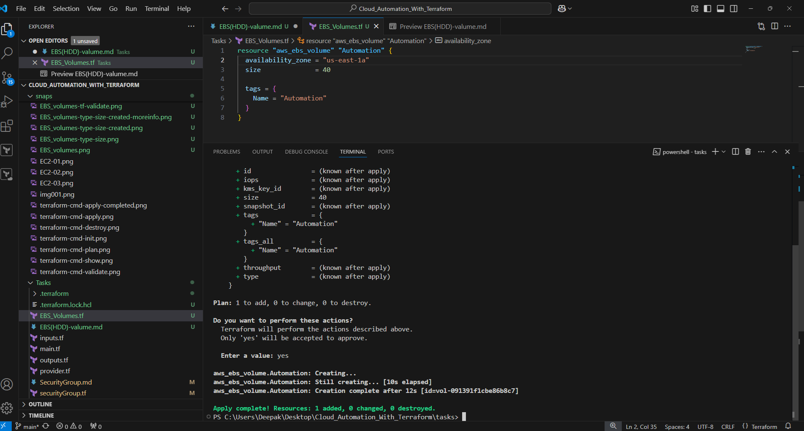

# Now Let's Jump into Small tasks to automate and practice #
## Activity:2
## Create EBS Volume (Hard Disk) (Manual) ##

**Note:** Make sure your 'Access Key' & 'Secret Key's are created and activated.

1. Create EBS Volume
    - Navigate to EC2 Services from the console
    - Click on EBS Volume from the left pane
    - Click on create button
      
    - Select the volumes type and size (other parameters too if you needed, not required otherwise)
      
    - Click on Create Button to create the EBS Volume (*it will take fracations of seconds to be active*)
      
    - Click on the Volume ID to see more details respective to the Volume created
      

## Create EBS Volume (Hard Disk) (Terraform) ##
## *Note: * At a time terraform supports only 1 source, hence kindly comment out the previouly created resource using /* with code */##

2. Create EBS Volume
    - Create a file with name EBS_Volumes.tf
      ```
      resource "aws_ebs_volume" "Automation" {
        availability_zone = "us-west-1a"
        size              = 40

        tags = {
        Name = "Automation"
            }
        }
      ```
    - Feel free to change the Volume Name, Zone & Size as per your own preference.
    - Now validate your tf file using below command to check syntax error or value errors
      ```powershell
      terraform validate
      ```
      
    - Create plan of resource you are going to create
      ```powershell
      terraform plan
      ```
      
    - If resource you are going to create are correct then simply apply command
      ```powershell
      terraform apply
      ```
      

3. Verify the EBS (Elastic Block Store) created using terraform, on the console.
    - Navigate to EC2 Instance Services
    - Select EBS Volumes link from left pane
      
    - Verify all the attributes are correct clicking no the group which is created.
      
