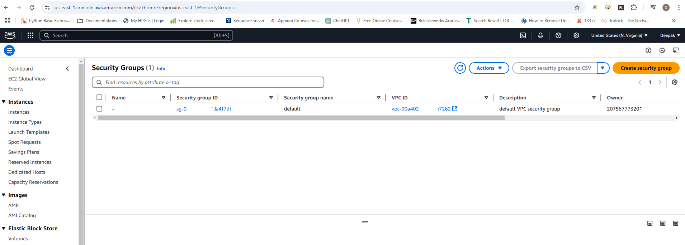
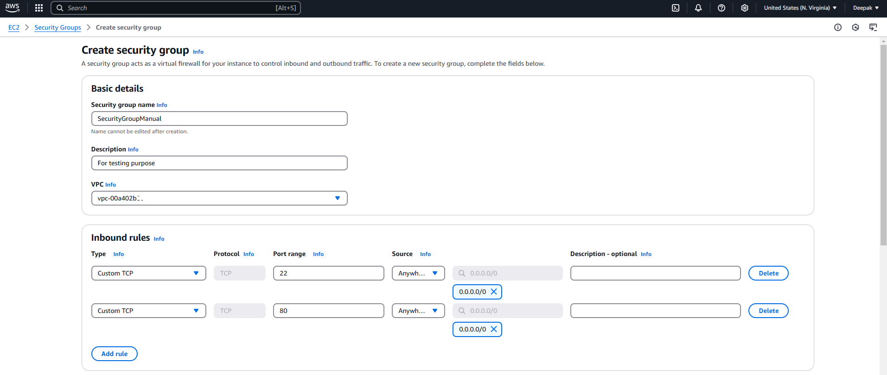
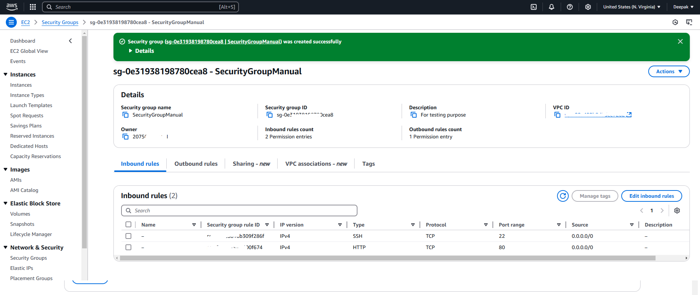

# Now Let's Jump into Small tasks to automate and practice #
## Create Security Group using console (Manual) ##

**Note:** Make sure your 'Access Key' & 'Secret Key's are created and activated.

1. Create Security Group

    **To create a security group using the console :**
    
    1. Open the Amazon EC2 console at https://console.aws.amazon.com/ec2/. 
    2. In the navigation pane, choose **Security Groups**.
    3. Choose **Create security group.**
    4. Enter a descriptive name and brief description for the security group. You can't change the name and description of a security group after it is created.
    5. For **VPC**, choose the VPC in which you'll run your Amazon EC2 instances.
    6. (Optional) To add inbound rules, choose Inbound rules. For each rule, choose Add rule and specify the protocol, port, and source. For example, to allow SSH traffic, choose SSH for Type and specify the public IPv4 address of your computer or network for Source.
    7. (Optional) To add outbound rules, choose Outbound rules. For each rule, choose Add rule and specify the protocol, port, and destination. Otherwise, you can keep the default rule, which allows all outbound traffic.
    8. (Optional) To add a tag, choose Add new tag and enter the tag key and value.
    9. Choose Create security group.
  
##To create a security group using the command line##
- [create-security-group (AWS CLI)](https://awscli.amazonaws.com/v2/documentation/api/latest/reference/ec2/create-security-group.html)
- [New-EC2SecurityGroup (AWS Tools for Windows PowerShell)](https://docs.aws.amazon.com/powershell/latest/reference/items/New-EC2SecurityGroup.html)

**Reference Snaps**
1. Create Security Group from EC2 console
    
    
    

  

  
  