# Project : Deploy Static Web #
## Activity: 5

**Note:** Make sure your 'Access Key' & 'Secret Key's are created and activated.

## 1.    Let's Understand and try creating manually ##
1.  Goto S3 Bucket Services
    
2.  Create S3 Bucket Manually
    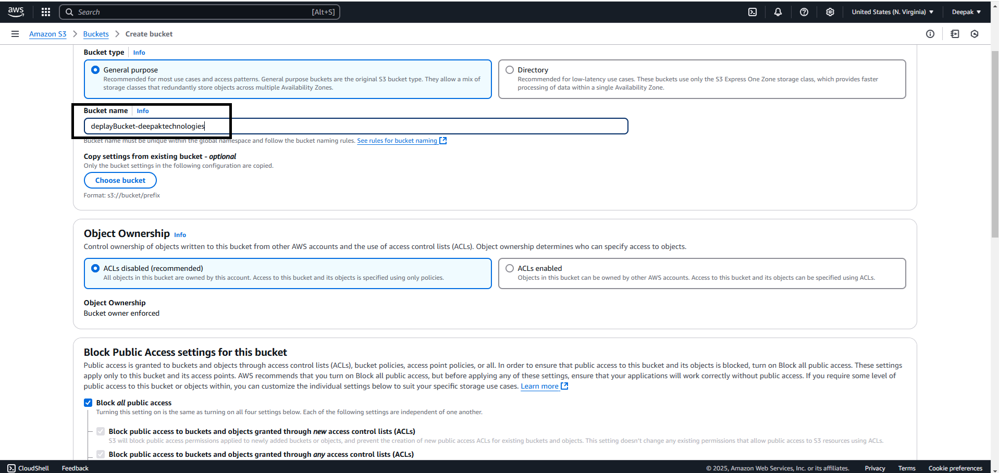
3.  Block Public Access settings for this bucket - uncheck
    Reson behind we want to access the website globally. and check acknowledge checkbox
    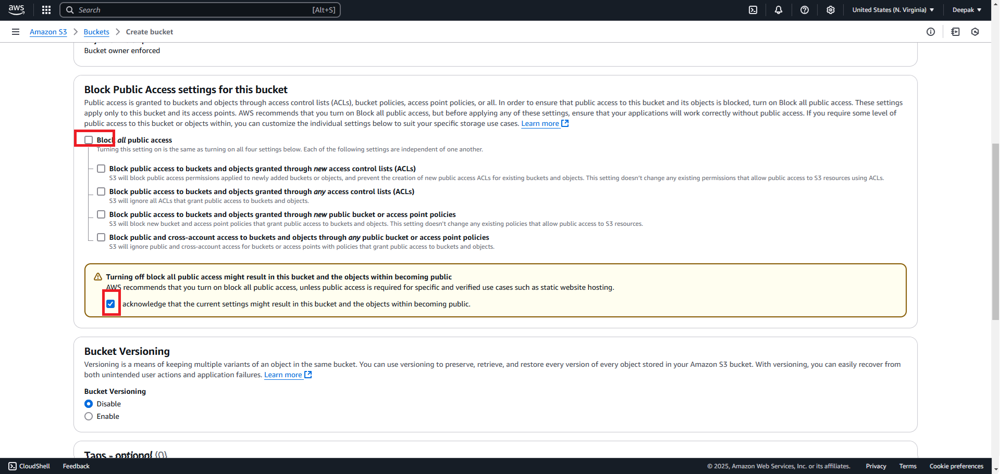
4.  Leave the rest of the setting defaul as is, will make changes as and when needed (for better understanding purpose)
    and click on Create Button.
    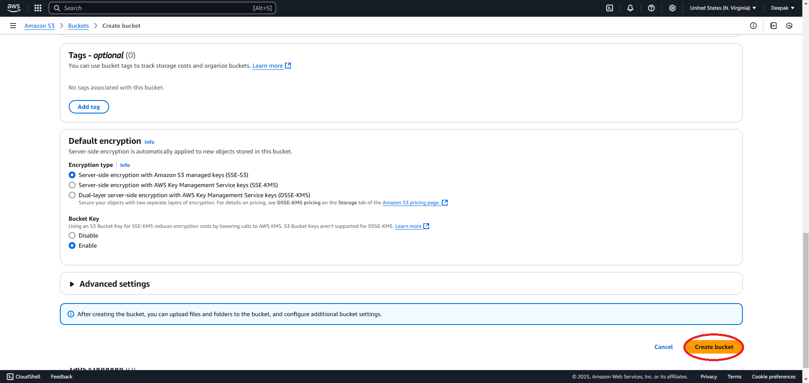
5.  By now bucket is created
    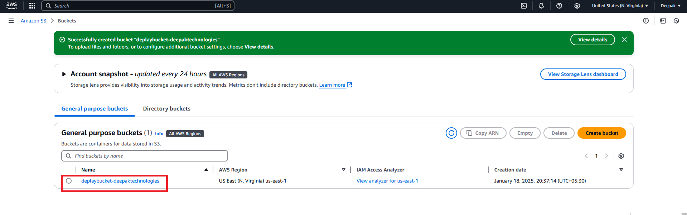
6.  Click on the bucket created, click on upload website's index.html file and click on upload.
    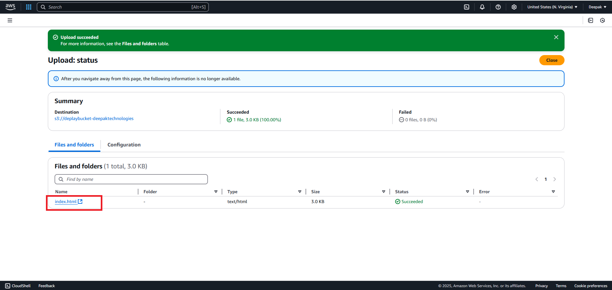
7.  To access the website, click on index.html file uploaded.
    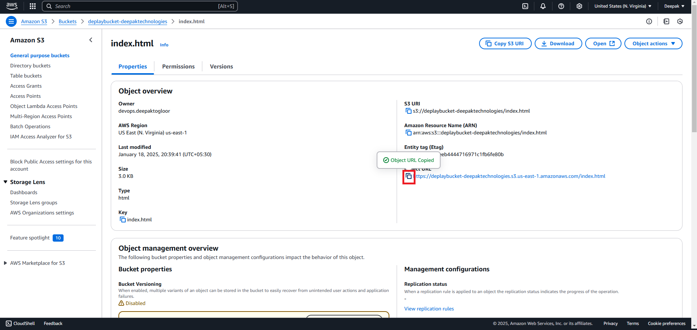
    **[Note]** This still cannot be accessed because it will given an *Access Denied* error message on the page.
    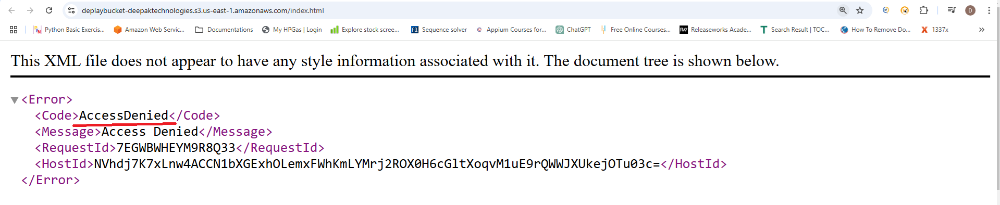
    because since we have enabled to public access at time of creation of bucket it does required additional policy to be applied as it's security and data privicy is concerned. it does additionally required 
    [*Setting permissions for website access*](https://docs.aws.amazon.com/AmazonS3/latest/userguide/WebsiteAccessPermissionsReqd.html)
    
    - Step 1: Edit S3 Block Public Access settings - already at the time of creation
    - Step 2: Add a bucket policy - add these under permissions tab
      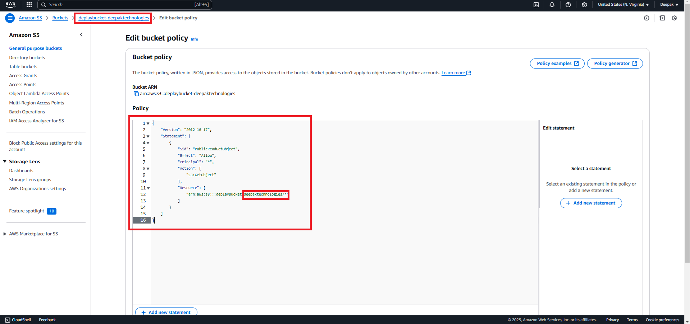
    - Object access control lists
8.  Try, accessing object website will be able to see sucessfully.
    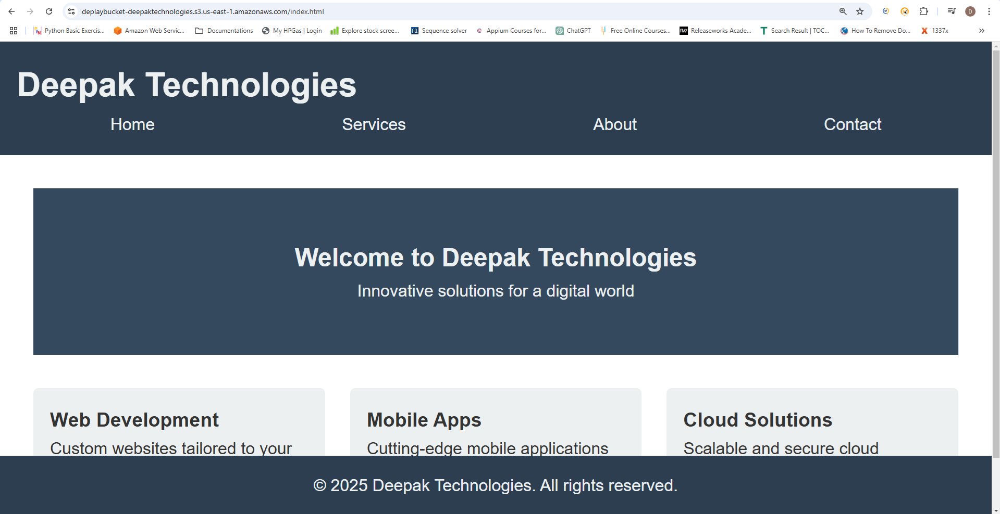

## 2.    Let's Understand and try creating using Terraform Automation ##
1.  As we already seen the how to create S3 bucket and upload the file, so just copy pasting same provider, resources as below
    ```powershell
        terraform {
            required_providers {
            aws = {
            source  = "hashicorp/aws",
            version = "~>5.83"
            }
            random = {
            source  = "hashicorp/random"
            version = "3.6.3"
                }
            }
        }

        resource "random_id" "rand_id" {
            byte_length = 8
        
        }

        resource "aws_s3_bucket" "S3website-bucket" {
            bucket = "website-bucket-${random_id.rand_id.hex}"
        }

        resource "aws_s3_object" "index_html" {
            bucket = aws_s3_bucket.S3website-bucket.id
            source = "./index.html"
            key = "index.html"
        }

        output "website" {
            value = random_id.rand_id.hex
        }
    ```
    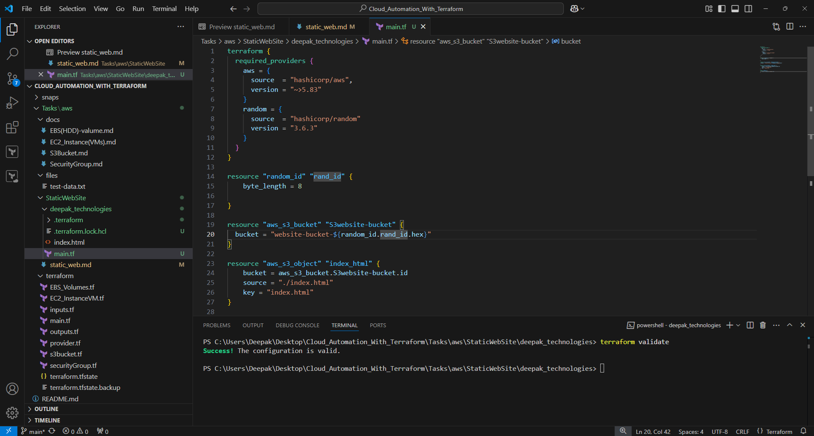
2.  Terraform apply to see bucket created and file uploaded
    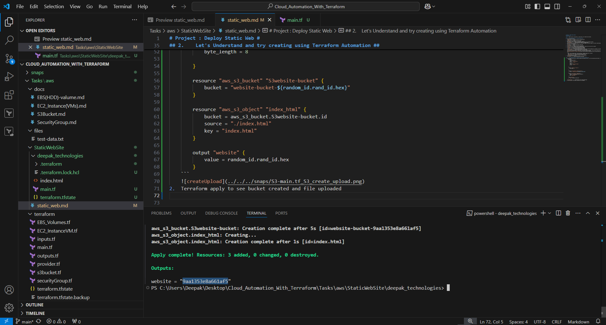
3.  Verify console bucket created
    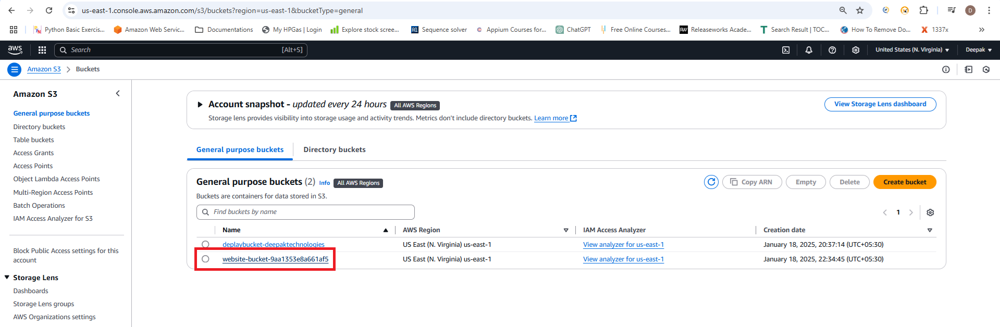
4.  Verify file uploaded under same bucket
    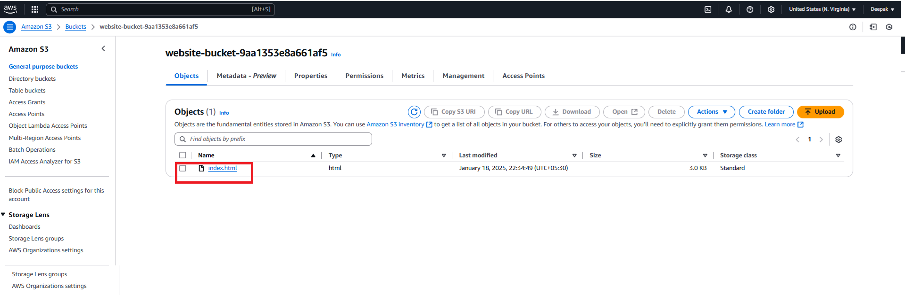
5.  Adding public access block disable in main.tf file
    ```powershell
        resource "aws_s3_bucket_public_access_block" "example" {
            bucket = aws_s3_bucket.example.id

            block_public_acls       = false
            block_public_policy     = false
            ignore_public_acls      = false
            restrict_public_buckets = false
        }
    ```
6.  Verify before terraform apply persmission access block should be on.
    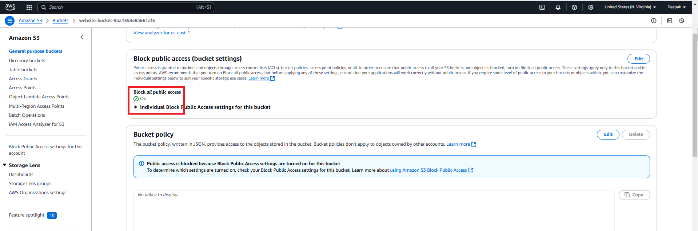
7.  Run the terraform apply and re-check, it should be off now.
    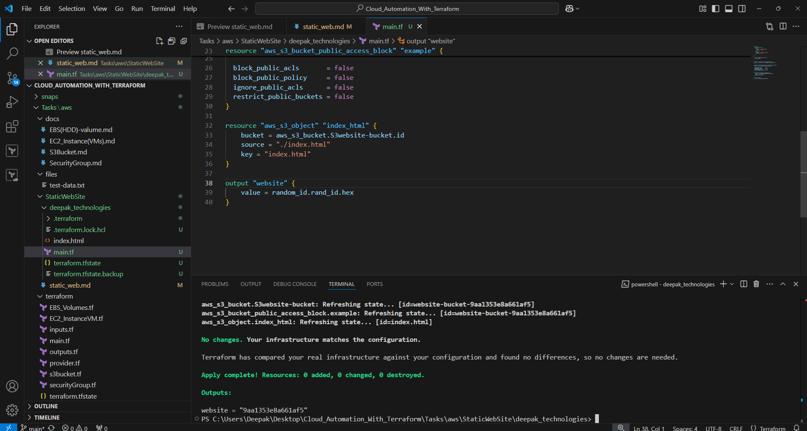
    - Verify permission public access is off.
    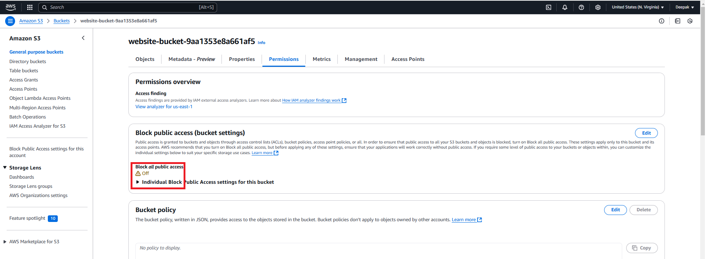
8.  Similarly apply Bucket policy for acess over the internet.
    ```powershell
    resource "aws_s3_bucket_policy" "static_web" {
        bucket = aws_s3_bucket.S3website-bucket.id
        policy = jsonencode(
            {
            Version = "2012-10-17",
            Statement = [
                {
                Sid = "PublicReadGetObject",
                Effect = "Allow",
                Principal = "*",
                Action = "s3:GetObject",
                Resource = "arn:aws:s3:::${aws_s3_bucket.S3website-bucket.id}/*"
                }
            ]
            }
        )
    }
    ```
    - Verify Before terraform apply 
    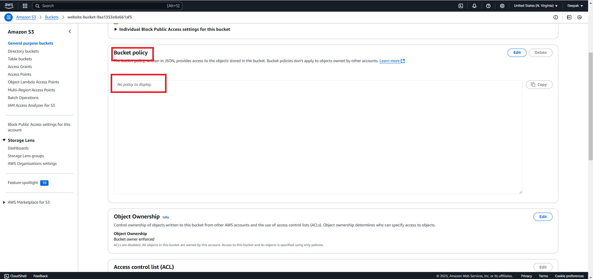
9.  Now terraform apply and re-verify policy applied.
    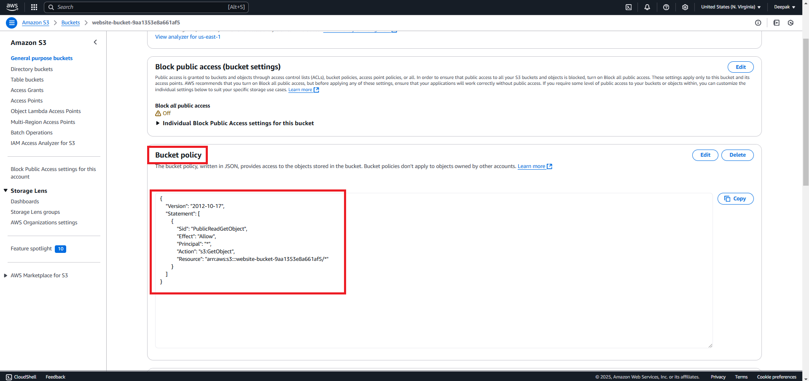    
10. Finally Resource: aws_s3_bucket_website_configuration has to be enabled under property tab
    ```powershell
        resource "aws_s3_bucket_website_configuration" "static_web" {
            bucket = aws_s3_bucket.S3website-bucket.id

        index_document {
            suffix = "index.html"
        }
    }
    ```
    - Before S3 static website hosting
    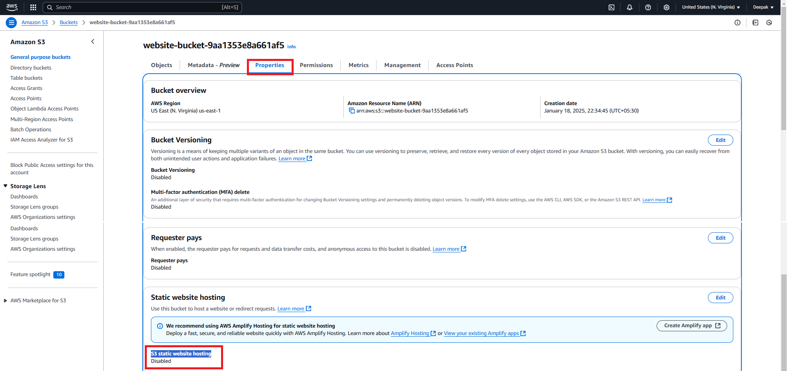
11. After terraform apply and re-verify property tab, static website hosting link will be generated.
    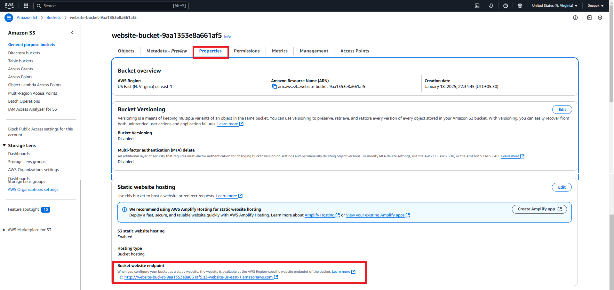
12. Copy and paste the [url]("http://website-bucket-06beff60851f76e2.s3-website-us-east-1.amazonaws.com") in the browser to land on 
    the website
    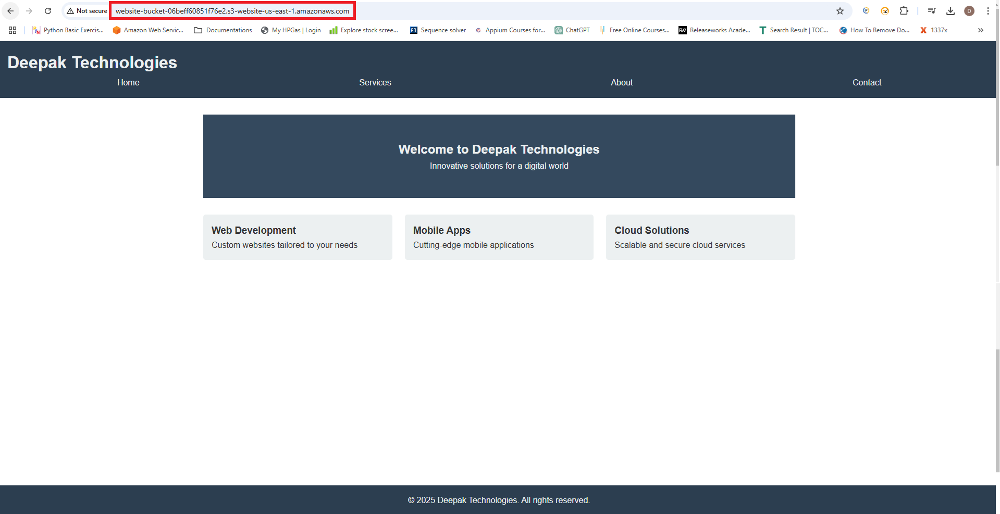
    


