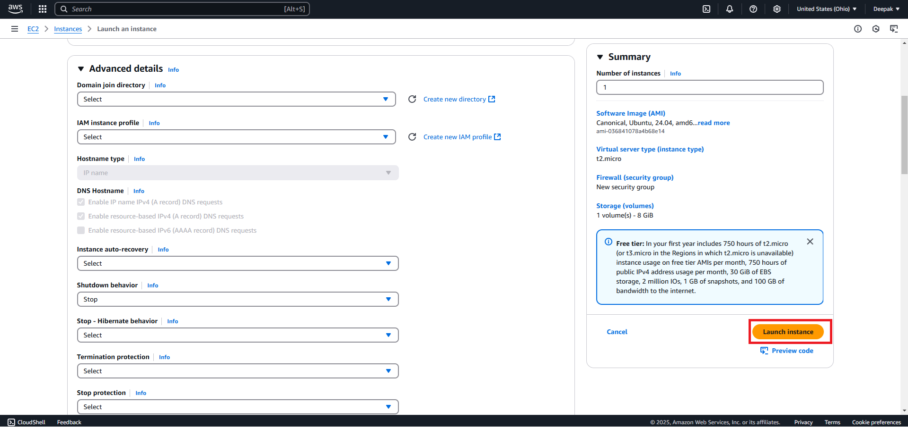

# Now Let's Jump into Small tasks to automate and practice #
## Activity:3
## Create EC2 Instances (VMs) (Manual) ##

**Note:** Make sure your 'Access Key' & 'Secret Key's are created and activated.

## Via Console ###

1. Login to Console
2. Search for EC2 Instance service
3. Select the Region in which you want to create Instance
4. Click on the Instances from the left plane
5. Click on Launch Instance
   
6. Provide below details based on requirement
    1.  Name and tags  Info
    2.  Application and OS Images (Amazon Machine Image)  Info
        
    3.  Instance type  Info | Get advice
    4.  Key pair (login)  Info
        
    5.  Network settings  Info (*Leaving As Is*)
        
    6.  Configure storage  Info (*Leaving As Is*)
        
    7.  Advanced details  Info (*Leaving As Is*)
    8.  Click On Launch Button
        
    9.  It will begin Launching Instance 
        
    10. Instance Sucess Message will appear
        
    11. Initialization Process starts
        
    12. Within Few Seconds Instance will be active and running
        
7. Connect the VM (Instance Created)
    1. Select the Check box provided to connect VM you wish to.
        
    2. Copy the command below highlighted
        
        ```powershell
        ssh -i "aws-key.pem" ubuntu@ec2-3-143-214-46.us-east-2.compute.amazonaws.com
        ```
    3. Now Open the PowerShell with Admin Previlages & navigate to the path where your .pem file is available.
    4. Paste the command copied and hit ENTER to add public keys to the VM
        
    5. If you want to install software on VMs such as sudo apt update
        ```powershell
        sudo apt update
        ```
        
    6. Try installing apache server on VM
        ```powershell
        sudo apt install -y apache2
        ```
        
    7. Verify status of apache server
        ```powershell
        sudo systemctl status apache2
        ```
        

## Via GUI ###
1.  Select the Instance and click on Instance ID
    
2.  Now Click on the Networking Tab and copy the Public Ip Address
    
3.  Open New Tab on browser and paste the ip address copied. 
    You are able to see "Site Cannot Be Reached" because of 80 Port is still Diabled.
    
4.  To Enabled the port 80, Come back to the console and now click on "Security Tab"
    And Click on "Security Group" Link
    
5.  It will redirect to Wizard, from below click on "Edit Rule" and Add New Rule with ingress for 80 Port.
    
    
6.  Now Go back to the new tab where IP address is pasted, Just refresh the page to see Apache2 Server WELCOME page.
    

## Create EC2 Instances Simple (VMs) (Using Terraform) ##
1.  Create new EC2Instances.tf file and copy paste below code snippet in the file and save.
    ```
    resource "aws_instance" "console" {
    ami           = "ami-04b4f1a9cf54c11d0" # us-east-2
    instance_type = "t2.micro"
    associate_public_ip_address = true
    key_name = "aws-key"
    vpc_security_group_ids = ["sg-0e31938198780cea8"]
    tags = {
        key_name = "EC2InstanceTerraform"
    }
    }
    ```
2.  Run the validate the tf file
    
3.  Run the plan
    
4.  Run apply 
    
5.  Verify on the console VM is initilized
    
6.  Verify more info clicking on instance id
    
7.  Destroy the instance 
    
8.  Verify on console vm is terminated 
    

## [Next_Topic > ](../../../Tasks/aws/docs/S3Bucket.md) ##