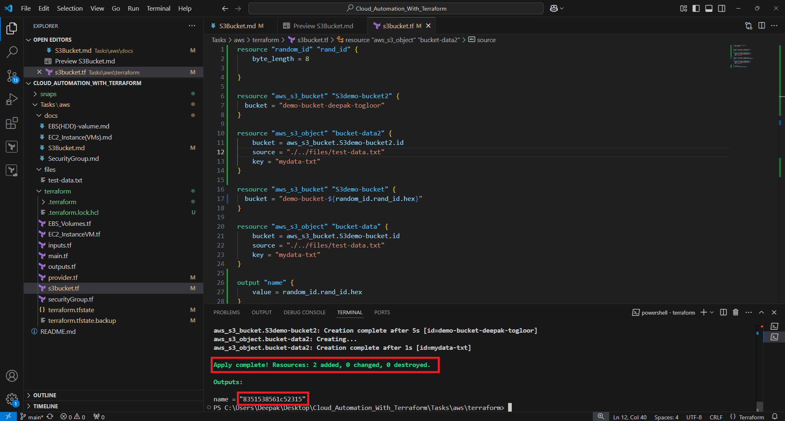

# Now Let's Jump into Small tasks to automate and practice #
## Activity:4
## Create S3 Bucket (Manual) ##

**Note:** Make sure your 'Access Key' & 'Secret Key's are created and activated.

## Via Console ###
1.  Login to the console
    
2.  Search for S3 bucket
    
3.  Click on Create Bucket
    
4.  Provide the Bucket name and simply click the "Create Bucket" button
    
5.  S3_Bucket service will start creating bucket for the user
    
6.  Refresh the page to see bucket created
    

## Create S3 Bucket (Terraform) ##
1.  Create new tf file.
2.  Add the simple resource with bucket name for now
    ```powershell
    resource "aws_s3_bucket" "S3demo-bucket" {
        bucket = "demo-bucket-deepak-togloor"
    }
    ```
    
3.  Run below command
    ```powershell
    Terraform apply --auto-approve
    ```
    
4.  Login back to close and goto S3 bucket and verify bucket is created.
    

## Let's add some data to S3 Bucket (Terraform) ##
1.  Add one more resource call S3_Butcket_Object to the tf file
    ```powershell
    resource "aws_s3_object" "bucket-data" {
        bucket = aws_s3_bucket.S3demo-bucket.id         #we need to add .id as it contains many attributes so to target the id, 
        source = "./../files/test-data.txt"             #need to add .id here
        key = "mydata-txt"
    }
    ```
    
2.  Apply the terraform command to upload file
    
3.  Go back to the bucket and refresh to see file uploaded
    

## Activity:5
## Let's see how to use RANDOM provider to get rid of HardCoding the values in tf file ##
1.  In a provider.tf underneath of aws provider section add random provider shown below.
    ```powershell
        random = {
        source  = "hashicorp/random"
        version = "3.6.3"
        }
    ```
    
2.  Now go to the source file.tf and add source random shown below.
    ```powershell
        resource "random_id" "rand_id" {
        byte_length = 8
        }

        resource "aws_s3_bucket" "S3demo-bucket" {
            bucket = "demo-bucket-${random_id.rand_id.hex}"
        }
    ```
    
3.  Now Run the terraform apply command to create and upload file in to newly created bucket.
    ### Old Buckets ###
    

    Run Terraform apply command and see
    

    ### new Buckets with hardcoded value###
    

    ### new Buckets with hardcoded value file varification ###
    
        

## [Next_Topic > ](../../../Tasks/aws/StaticWebSite/static_web.md) ##