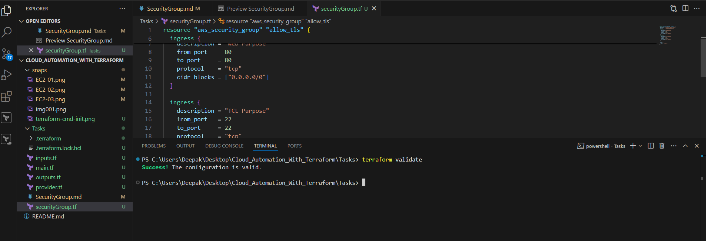
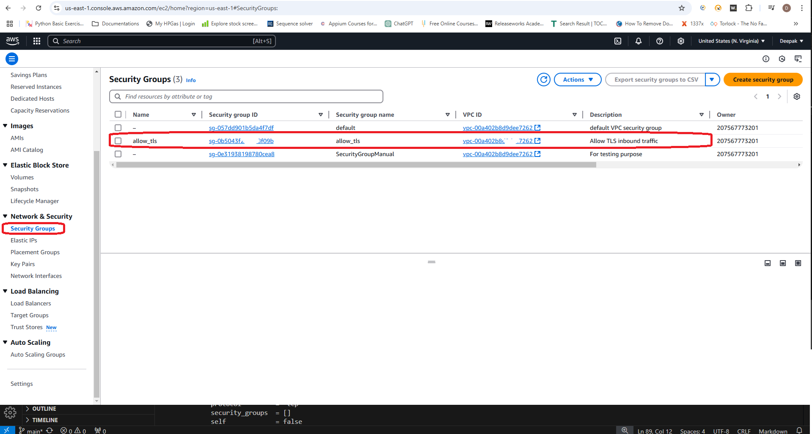

# Now Let's Jump into Small tasks to automate and practice #
## Activity:1
## Create Security Group using console (Manual) ##

**Note:** Make sure your 'Access Key' & 'Secret Key's are created and activated.

1. Create Security Group

    **To create a security group using the console :**
    
    1. Open the Amazon EC2 console at https://console.aws.amazon.com/ec2/. 
    2. In the navigation pane, choose **Security Groups**.
    3. Choose **Create security group.**
    4. Enter a descriptive name and brief description for the security group. You can't change the name and description of a security group after it is created.
    5. For **VPC**, choose the VPC in which you'll run your Amazon EC2 instances.
    6. (Optional) To add inbound rules, choose Inbound rules. For each rule, choose Add rule and specify the protocol, port, and source. For example, to allow SSH traffic, choose SSH for Type and specify the public IPv4 address of your computer or network for Source.
    7. (Optional) To add outbound rules, choose Outbound rules. For each rule, choose Add rule and specify the protocol, port, and destination. Otherwise, you can keep the default rule, which allows all outbound traffic.
    8. (Optional) To add a tag, choose Add new tag and enter the tag key and value.
    9. Choose Create security group.
  
##To create a security group using the command line##
- [create-security-group (AWS CLI)](https://awscli.amazonaws.com/v2/documentation/api/latest/reference/ec2/create-security-group.html)
- [New-EC2SecurityGroup (AWS Tools for Windows PowerShell)](https://docs.aws.amazon.com/powershell/latest/reference/items/New-EC2SecurityGroup.html)

**Reference Snaps**
1. Create Security Group from EC2 console
    

    

    

2. Create Security Group from Terraform AWS CLI
    [ReferenceGuide](https://registry.terraform.io/providers/hashicorp/aws/2.54.0/docs/resources/security_group)
    1. Create a SecurityGroup.tf file and paste the below code in the file and save.

        ```
        resource "aws_security_group" "allow_tls" {
            name        = "allow_tls"
            description = "Allow TLS inbound traffic"

        ingress {
            description = "Web Port Opening Purpose"
            from_port   = 80
            to_port     = 80
            protocol    = "tcp"
            cidr_blocks = ["0.0.0.0/0"]
        }

        ingress {
            description = "CLI port opening purpose"
            from_port   = 0
            to_port     = 0
            protocol    = "tcp"
            cidr_blocks = ["0.0.0.0/0"]
        }

        tags = {
            Name = "allow_tls"
        }}
        ```
    2. Now go the path where your provider.tf and SecurityGroup.tf file are created.
    3. Initialize the Terraform using below command
        ```powershell
        terraform init
        ```
        
    4. Run the below below command to validate .tf file created is not having any error
        ```powershell
        terraform validate
        ```
        
    5. Run the below below command to see the plan
        ```powershell
        terraform plan
        ```
        
    6. Run the below below command to see the apply, whenever it asks for confirmation provide 'Yes' or if you want to auto approve use -y at the end.
        ```powershell
        terraform apply
        ```
        

        ## after completion
        
    
    7. Finally to see what infrastrcutre provision has been done using terraform use the below command
        ```powershell
        terraform show
        ```
        


3. Verify the Security_Group created using terraform on the console.
    - Navigate to EC2 Instance Services
    - Select Security Group link from left pane
      
    - Verify all the attributes are correct clicking no the group which is created.
      

4. Finally delete / destroy the SecurityGroup or Infra that you have provided using below command.
    - *Basically this will delete the .tfstate file content and also delete the SecurityGroup infra which is provisioned on AWS. also helps creating all the details to backfile for reference.*

        ```powershell
        terraform destroy
        ```
        

## [Next_Topic > ](../../../Tasks/aws/docs/EBS(HDD)-valume.md) ##
