# Learn New Concept VPC (Virtual Private Cloud) #
## Activity: 6

**Note:** Make sure your 'Access Key' & 'Secret Key's are created and activated.

## VPC :
### A private, isolated network within the AWS cloud where you can launch and manage your resources securly.

For Eg:
1.  You are website is ready and planning to deploy.
    -   Where to deploy?
        -   Region              Asia -> East - Bangalore
        -   Availability Zones  A="HSR", B="E-city", C="Devanahalli"

## Subnets ##
### A subnet is a smaller, segmented part of a larger network that isolates and organizes devices within a specific IP address range. ###

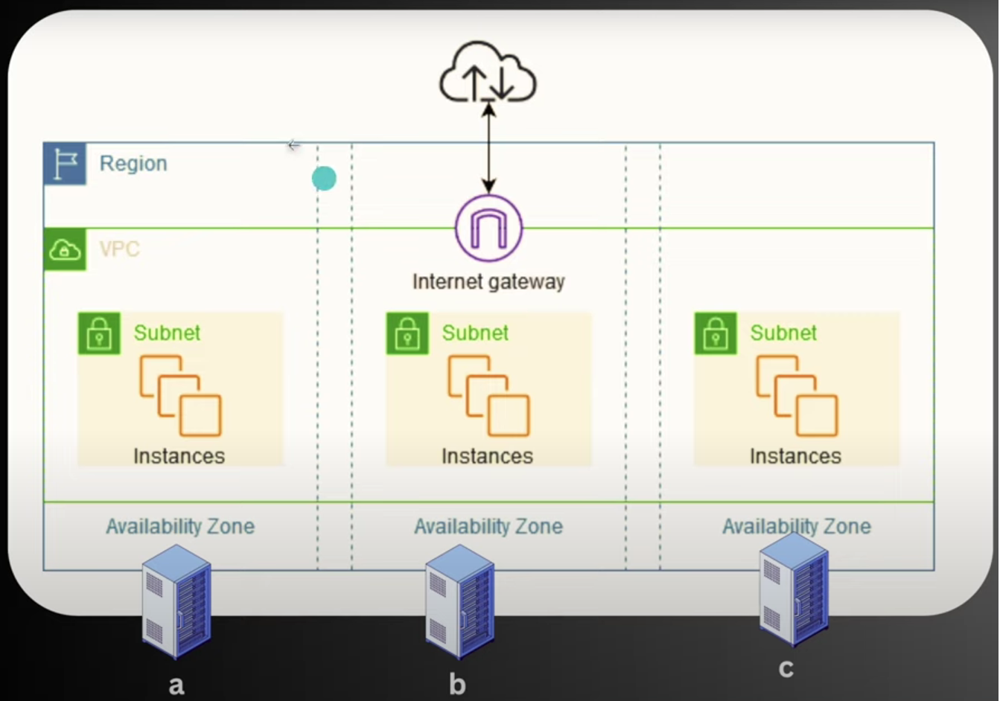

* PVC         : is regaion based
* Zone        : is subnet specific comes under the PVC
* Resources   : deployed under subnets (Eg. EC2 Instances)

### VPC CIDR Block
* When you create a PVC, you specify a CIDR block that defines the IP   
  address range for the entire VPC.
  For Ex:
  ```powershell
  10.0.0.0/16
  ```
  This block allows for 65,536 IP addresses (but in reality, 65,531 usable adddresses)

  ### CIDR (Classless Inter-Domain Routing) is a method for allocation of IP addressess and routing Internet Protocol (IP) packets.

  ### What happens when creating subnet?
  **CIDR Block Allocation:**
  You specify a range of IP addresses (CIDR Block) within the PVC's IP address range for the subnet.

  This dertermines the pool of IP addresses available for instances in the subnet.

  #### Subnet CIDR Blocks
  Within the PVC, you can create subnets by allocating smaller CIDR blocks from the PVC's range.

  For Example:
  * Public Subnet   : 10.0.1.0/24
  * Private Subnet  : 10.0.2.0/24

  Each fo these subnets has 256 IP addresses (251 usable)

  #### What does /24 in the IP address.
  * An IPv4 addresses is 32 bits long
    * Eg in Binary: `10.0.1.0` -> `00001010.00000000.00000001.00000000`

    * The /24 indicates that the first 24 bits are the network portion of the address.
    * The remaining 8 bits are available for the host addresses within the network.

    `10.0.1.0` to `10.0.1.255` is the full range. 

## Route Table ##
A Route table is a set of rules, called routes, that are used to determine where network traffic from your subnets or gateway directed. Each subnet in your PVC must be associated witha a route table, which controls the routing for the subnets.

Use case 1 :
Eg: I have created 1 public subnet with 10.0.1.0/24, Purpose is to expose your website to internet so that anybody can access the IP globally.

The range of IPs which are comes under public subnet ip are only has to be exposed to public is taken care by the ROUTE TABLE as a decision maker.

Use case 2 :
Eg: I have created 1 private subnet with 10.0.2.0/24, Purpose is to not to expose your DB to internet but you want to internally stay connected to it for storing data accepted by the public network, and can only be accessed internally.

The range of IPs which are comes under public subnet ip are only has not to be exposed to publicly will be taken care by the ROUTE TABLE as a decision maker.

*Hence where all the subnets are eventually and must associated with Route Table.*

## Internet Gateway ##
An Internet Gateway is a component that allows communication between instance in your VPC internet

## Security Groups ##
Network firewall rules that control inbound and outbound traffic for instances.

## VPC Creation manually on AWS cloud ##
Step:1:
    1.  Login to the console
    2.  Search for VPC in search bar and click on VPC
        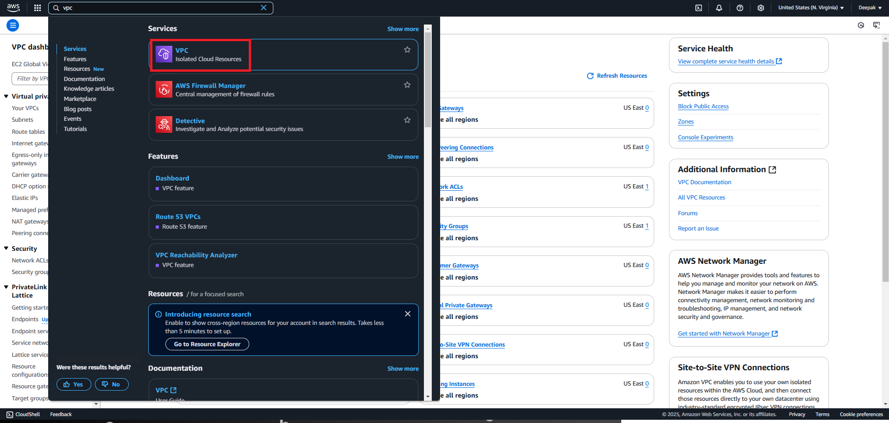
    3.  Click on Create VPC button
        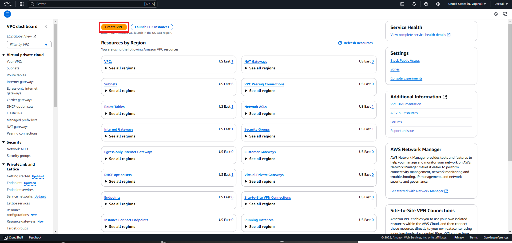
    4.  Fill the details as below and click on Create VPC button
        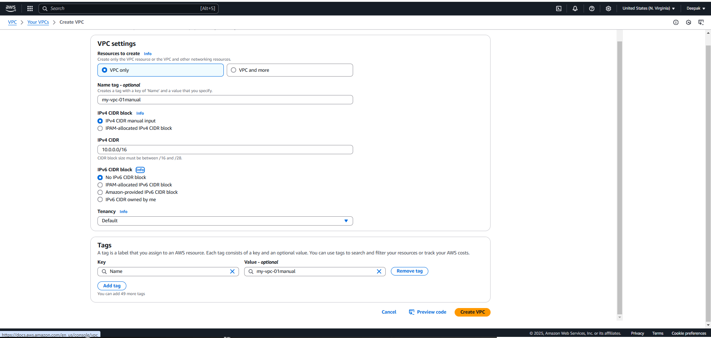
    5.  PVC created and route table attached by default.
        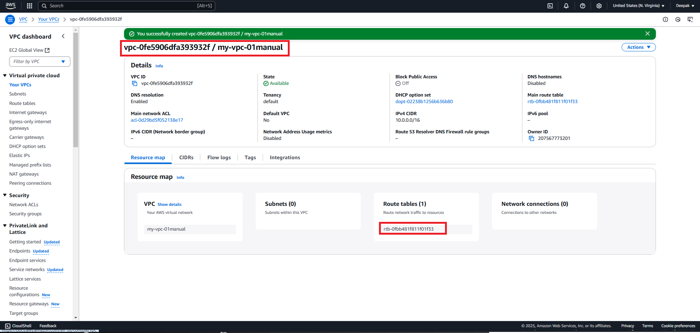
Step:2:
    1.  Click on Subnets from laft pane and click on Create Subnets button on the top right
        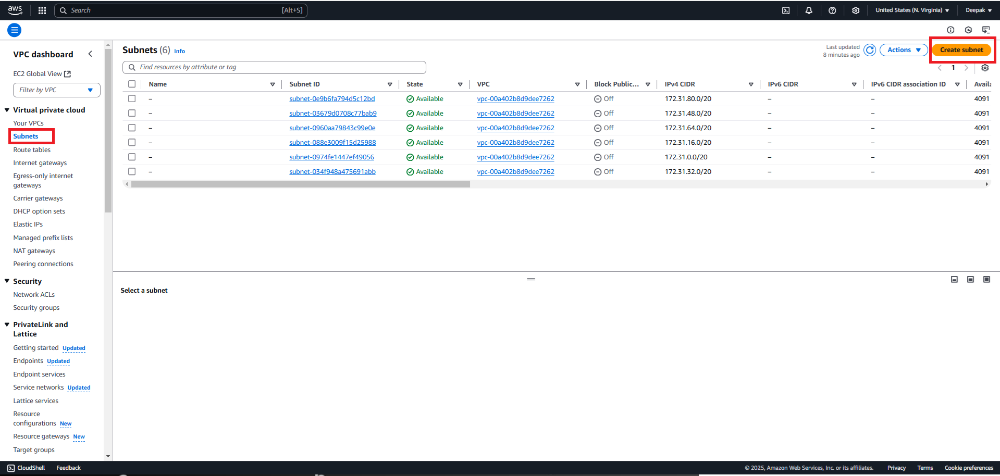
    2.  Create public subnet and click on Add new subnet
        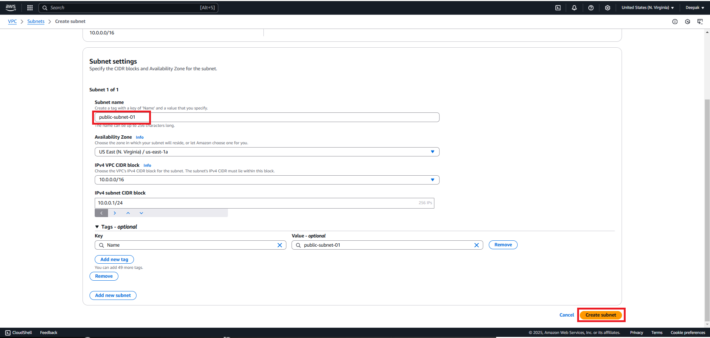
    3.  Enter the details of Private Subnet and click on Create Subnet
        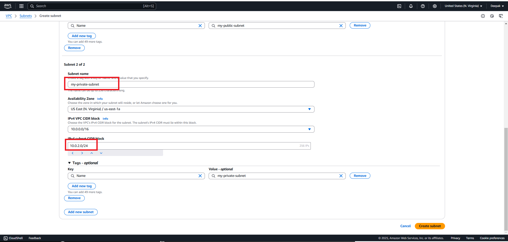
    4.  Subnets will be shown once created
        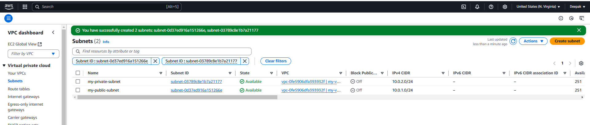
Step:3:
    1.  Create Route Tables
    2.  Enter the details to create Table
        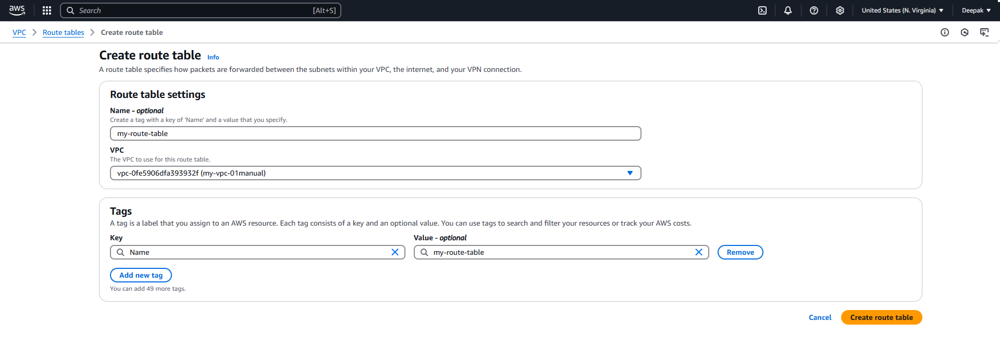
        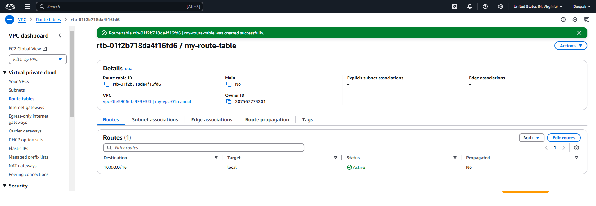

Step:4:
    1.  Create a gateway (To expose public subnet)
        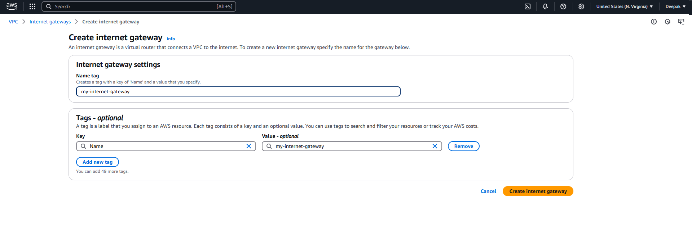
    2.  Attach to VPC that you want.
        
    
Step:5
    1.  Attach the Internet Gateway created to your PVC
        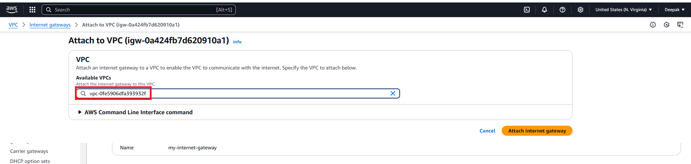
    2.  On a Route Tables both Private & Public subnets are associated with 
        main vpc, if you want to expose only public subnet to globally associate the subnet with your vpc.
        
        
    3.  Go Edit routes for public subnet and add all range of ips can hit on 
        internet gateway and link with your vpc.
        
        

Step:6
* At the End come to your VPC created and check the map
    * Should have 1 VPC
      * 2 Subnets we have created
        * Public subnet
        * Private subnet
          * Public subnet should connected to Internet Gateway
          * Private subnet shouldn't connected or exposed.

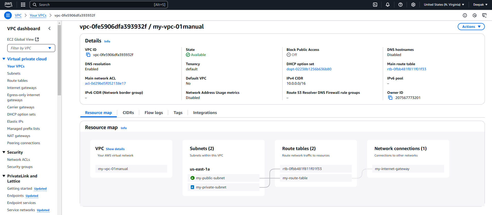

Step:7
* Let's create one instance under VPC subnet
1.  Login to console 
2.  Goto EC2 Instance and Create 1 instance
3.  Keep all the default settings as is and just edit the vpc settings and select your desired one.
    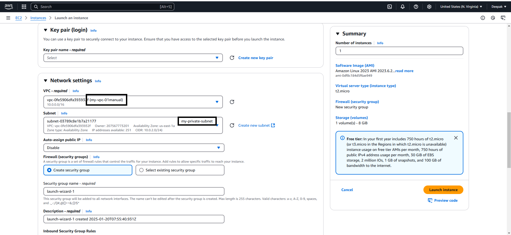
4.  EC2 Instances is created sucessfully with name *my-webserver*
    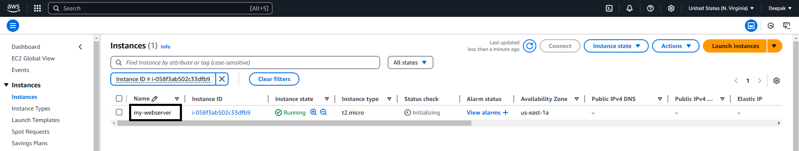
5.  Click on the Instance created to see more info about only private IP is assigned.
    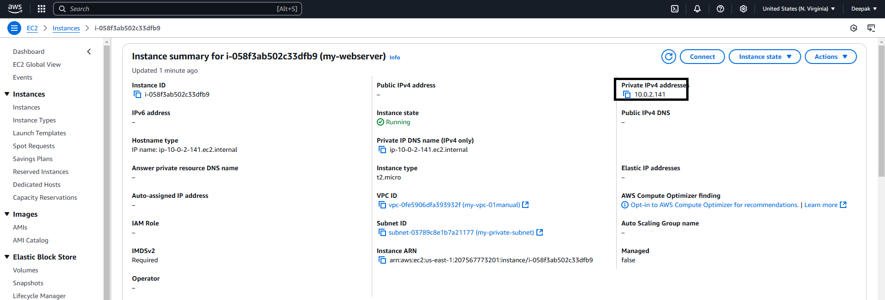


## VPC Creation using Terraform on AWS cloud ##
1.  Create a pvc with CIDR block
    ```powershell
    resource "aws_vpc" "my-vpc" {
        cidr_block = "10.0.0.0/16"
        tags = {
            name = "my_vpc"
        }
    }
    ```
2.  Create Private Subnet
    ```powershell
    resource "aws_subnet" "my-pri-sub" {
        cidr_block = "10.0.1.0/24"
        vpc_id = aws_vpc.my-vpc.id
    }
    ```
3.  Create Public Subnet
    ```powershell
    resource "aws_subnet" "my-pub-sub" {
        cidr_block = "10.0.2.0/24"
        vpc_id = aws_vpc.my-vpc.id
        tags = {
            name = "public-subnet"
        }
    }
    ```
4.  Create Internet Gateway
    ```powershell
    resource "aws_internet_gateway" "my-igw" {
        vpc_id = aws_vpc.my-vpc.id
        tags = {
            name = "my-igw"
        }
    }
    ```
5.  Create Routing Table
    ```powershell
    resource "aws_route" "my-rt" {
        vpc_id = aws_vpc.my_vpc.vpc_id

        route {
            cidr_block = "0.0.0.0/0"
            gateway_id = aws_internet_gateway.my-igw.id
        }
    }
    ```
6.  Associate the route table
    ```powershell
    resource "aws_route_table_association" "pub-sub" {
       route_table_id = aws_route.my-rt.id
        subnet_id = aws_subnet.my-pub-sub.id
    }
    ```
7.  Validate Terraform and Apply if succeeds.
    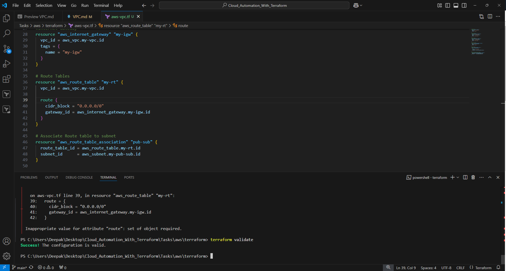

    Just for demo purpose i have deleted manually created vpc and kept the defaul one.
    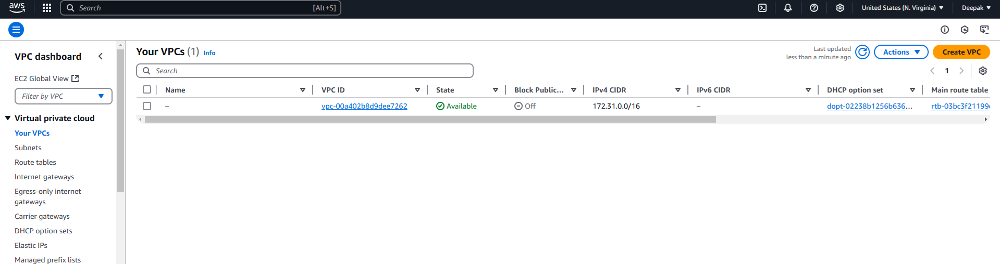
8.  Now Terraform apply and refresh the PVC page to see PVC created and all the mappings showed in manual steps above.
    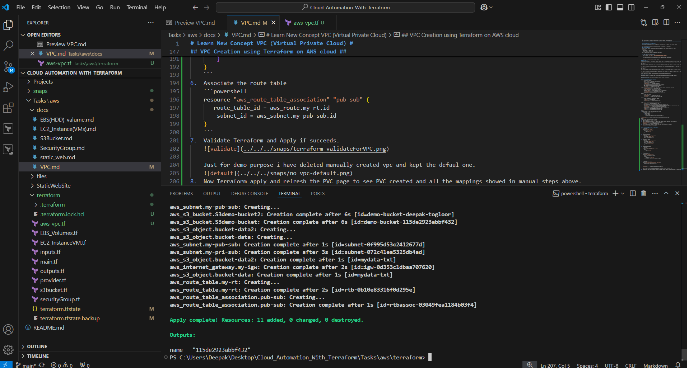
9.  Goto Console and validate VPC, Subnets, Internet Gateway, Route Tables are created.
    ### VPC & Subnets
    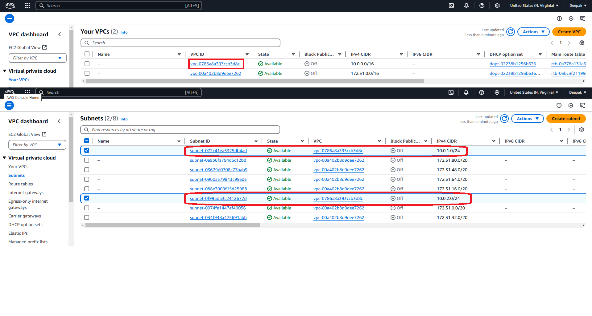
    ### Routes & Associated Subnets
    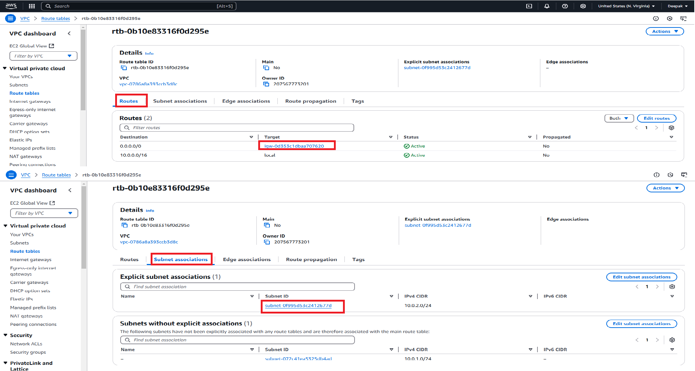
    ### VPC Internet Gateway
    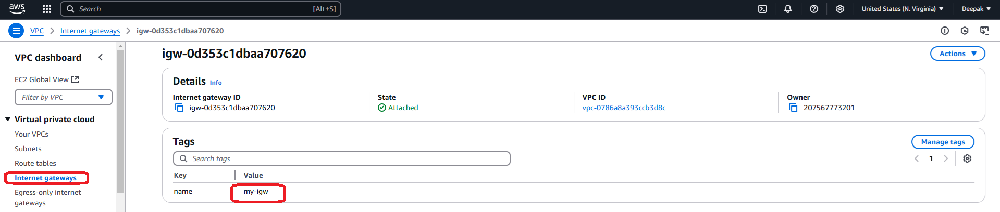
    ### Resource Map
    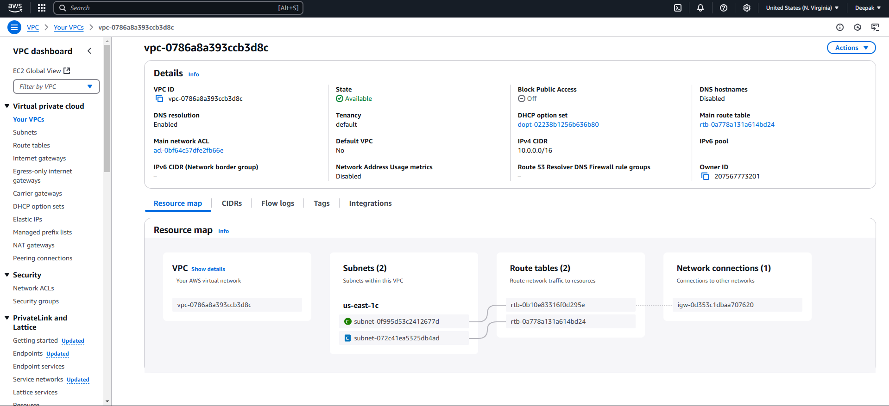


