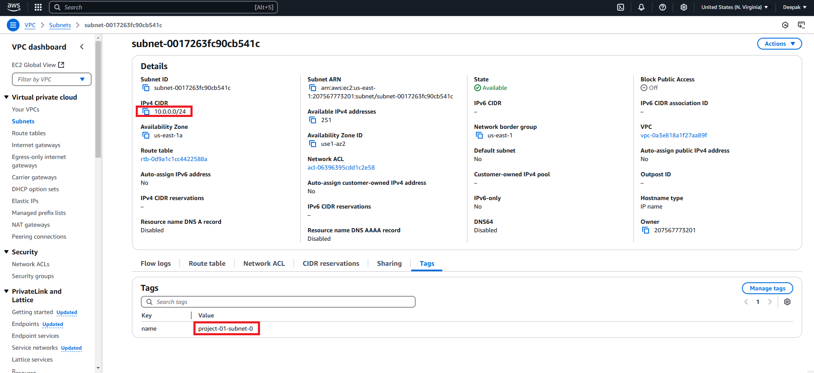

# Multiple Resource using Count
Scenario:
Let's create 2 subnet marks namely 
- subnet 1 with ip range (10.0.0.0/24)
- subnet 2 with ip range (10.0.1.0/24)

Since we are creating subnet we must need provider so lets add provider in the main.tf file.
```bash
terraform {
  required_providers {
    aws = {
        source = "hashicorp/aws"
        version = "~> 5.54.1"
    }
  }
}

provider "aws" {
  region = var.region
}
```
## In normal way 
```bash
resource "aws_vpc" "my_vpc" {
    cidr_block = "10.0.0.0/16"
}

resource "aws_subnet" "main" {          #subnet 1
    vpc_id = aws_vpc.my_vpc.id
    cidr_block = "10.0.0.0/24"
}

resource "aws_subnet" "sub-main" {      #subnet2
    vpc_id = aws_vpc.my_vpc.id
    cidr_block = "10.0.1.0/24"
}
```
But what if we need to create 100 of subnets? copy pasting is not a good way so we have to create subnets in dynamic use count function and assign the value to it. Eg: count = 2.
```bash
resource "aws_subnet" "sub-main" {      
    vpc_id = aws_vpc.my_vpc.id
    cidr_block = "10.0.1.0/24"
    count = 2
}
```
However it creates the subnets the value you have provided, 
but the thing is after creating 1 subnet, upon 2nd iteration of subnet creating it will be taking same static ip range which is 10.0.0.0/24 only.
```bash
resource "aws_subnet" "main" {
    vpc_id = aws_vpc.my_vpc.id
    cidr_block = "10.0.${count.index}.0/24"
    count = 2
    tags = {
        name = "${local.project}-subnet-${count.index}"
    }
}
```
Terraform apply to see sucessfully created 1 vpc and 2 subnets = 3 should be added

Verify on console

Now Verify Subnet1 tag and id properly assigned

Similarly Subet 2 tag and id properly assigned 

Verify Subnet Names also


Ok so we achived creating subnet using dynamic way and also seen 2 subnets are created.
Now how to retrive the subnet_id using output.?
- usually we use to retrive any values in output block like below.
```bash
output "vpc_id" {
    value = aws_subnet.main.id
}
```
So it will give an error as becuase we have used the list within the block and return value also in the form of list only and the above output will give error.
```
│ Error: Missing resource instance key
│ 
│   on main.tf line 34, in output "vpc_id":
│   34:     value = aws_subnet.main.id
│ 
│ Because aws_subnet.main has "count" set, its attributes must be accessed on specific instances.
│ 
│ For example, to correlate with indices of a referring resource, use:
│     aws_subnet.main[count.index]
```
To Achive this to get the subnet_ids we have to use indexing value
```bash
output "vpc_id" {
    value = aws_subnet.main[0].id                   # main[1] is to retrive 2nd subnet id
}
```
output:
```
Changes to Outputs:
  + vpc_id = "subnet-0017263fc90cb541c"
```
```bash
output "vpc_id" {
    value = aws_subnet.main[1].id                   
}
```
output:
```
Changes to Outputs:
  + vpc_id = "subnet-0b71ce3d72a4bdadd"
```

## Level up the apply some logic to achive the below architecture

```bash
# Create 4 instances 2 instances each subnet
resource "aws_instance" "main" {
    ami = "ami-0ac4dfaf1c5c0cce9"
    instance_type = "t3.micro"
    count = 4
    subnet_id = element(aws_subnet.main[*].id, count.index % length(aws_subnet.main))
    tags = {
        Name = "${local.project}-instance-${count.index}"
    }
}
```


## [Next_Topic > ](../../../Tasks/aws/docs/modules.md) ##