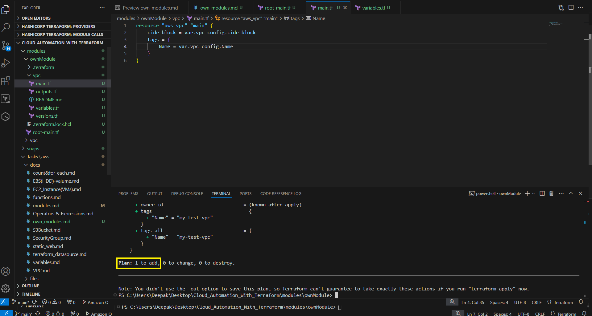
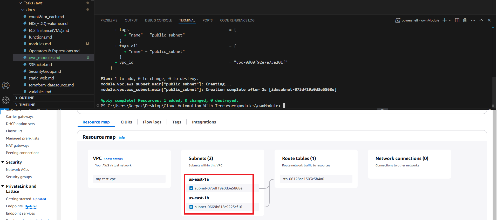

# Create your own module


Let's create a folder structure
```
| - tf-own-modules (root directirt)
| - - root-main.tf (file)
| - VPC (child directory)
| - - main.tf (file)
| - - ouputs.tf (file)
| - - README.md (file)
| - - variables.tf (file)
| - - versions.tf (file)
```

## versions.tf
```bash
terraform {
  required_version = ">=1.0"

  required_providers {
    aws = {
        source = "hashicorp/aws"
        version = ">=5.30"
    }
  }
}
```

## variables.tf
## Requirement: Accept the Cidr_block from the user to create VPC
- Here we need to accept the input from the user, so all input accepted are declared in the file.
```bash
variable "vpc_config" {
    description = "To get the cidr and name of the pvc from the user"
    type = object({
      cidr_block = string
      Name = string
    })
}
```
## main.tf
- Although we have created variable block to accept the value from the user in the variables.tf and to execute the module we write the logic in main.tf using resources block.
```bash
resource "aws_vpc" "main" {
    cidr_block = var.vpc_config.cidr_block
    tags = {
        Name = var.vpc_config.name
    }
}
```
## root-main.tf
- we have sucessfully created variables.tf and execution resource in the main.tf, now have to create the module in the root-main.tf
```bash
module "vpc" {
    source = "./vpc"                        # specify the path where your vpc_config resource is created
    vpc_config = {                          # it must required vpc_config properties to create vpc.
        cidr_block = "10.0.0.0/16"
        Name = "my-test-vpc"
    }
}
```
Run command 
```powershell
Terraform init
```


```powershell
Terraform plan
```

```powershell
Terraform apply
```

Created VPC


# Requirrement : User can create multiple subnets
- Get CIDR block for subnet from user
- Get AZS (availability Zone)
- User can mark a subnet as public (default is private)
    - if public, create IGW (Internet Gateway)
    - Associate public subnet with Routing Table

**To get the input from user CIDR block subnet, As mentioned above all the inputs we are referring the variables.tf file so let's jump to the file and create variables.**
```bash
variable "subnet_config" {
    description = "Accept the input from the user subnet details"
    type = map(object({
      cidr_block = string
      Name = string
      availability_zone = string
    }))
}
```
Now the implemation / execution part in main.tf
```bash
resource "aws_subnet" "main" {
    vpc_id = aws_vpc.main.id
    
    for_each = var.subnet_config
    cidr_block = each.value.cidr_block
    
    availability_zone = each.value.availability_zone

    tags = {
        name = each.key
    } 
}
```
Now do int module file i.e main-root.tf
```bash
module "vpc" {
  source = "./vpc"
  vpc_config = {
    cidr_block = "10.0.0.0/16"
    Name       = "my-test-vpc"
  }
  subnet_config = {
    public_subnet = {
      cidr_block        = "10.0.0.0/24"
      availability_zone = "us-east-1a"
    }
    private_subnet = {
      cidr_block        = "10.0.1.0/24"
      availability_zone = "us-east-1b"
    }
  }
}
```


After terraform apply subnets will be created.



**If public create create IGW (Internet Gateway)** 
**root-main.tf** file add public = true
```bash
subnet_config = {
    public_subnet = {
      cidr_block        = "10.0.0.0/24"
      availability_zone = "us-east-1a"
      public            = true
    }
```
**main.tf**
```bash
locals {
  public_subnet = {
    #key={} if public is true in subnet config
    for key, config in var.subnet_config : key => config if config.public
  }
}
#Internet Gateway, if there is atleast one public subnet
resource "aws_internet_gateway" "main" {
  vpc_id = aws_subnet.main
  count  = length(local.public_subnet) > 0 ? 1 : 0
}
```
**Note** if true 3 properties will be added, if public = false and 4 properties will be added.

**Create a route table**
**main.tf**
```bash
# Route Table create
resource "aws_route_table" "main" {
    count  = length(local.public_subnet) > 0 ? 1 : 0
    vpc_id = aws_vpc.main.id
    route = {
        cidr_block = "0.0.0.0/0"
        gateway_id = aws_internet_gateway.main[0].id
    }
}
```
**Route table association**
```bash
resource "aws_route_table_association" "main" {
    for_each = local.public_subnet
    subnet_id = aws_subnet.main[each.key].id
    route_table_id = aws_route_table.main[0].id
}
```


