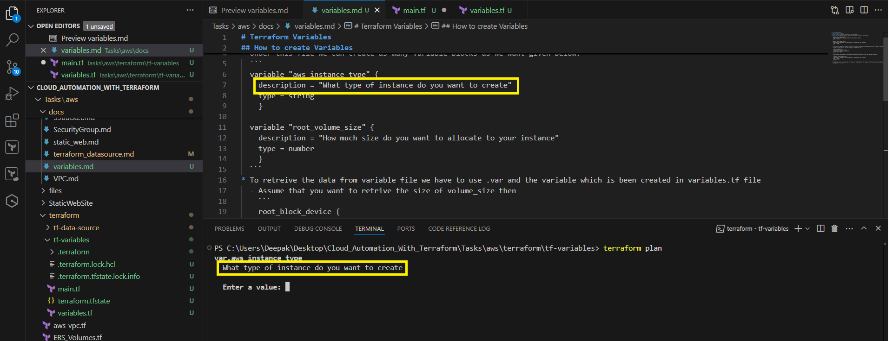
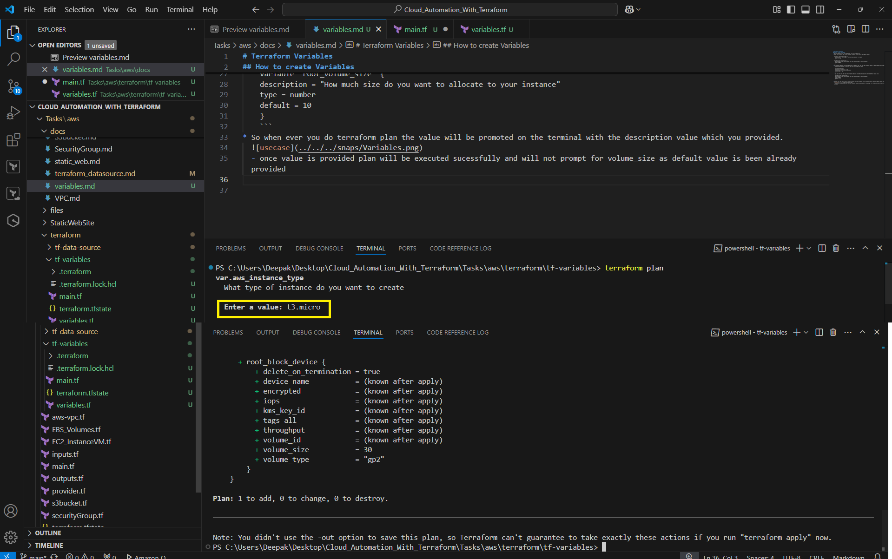
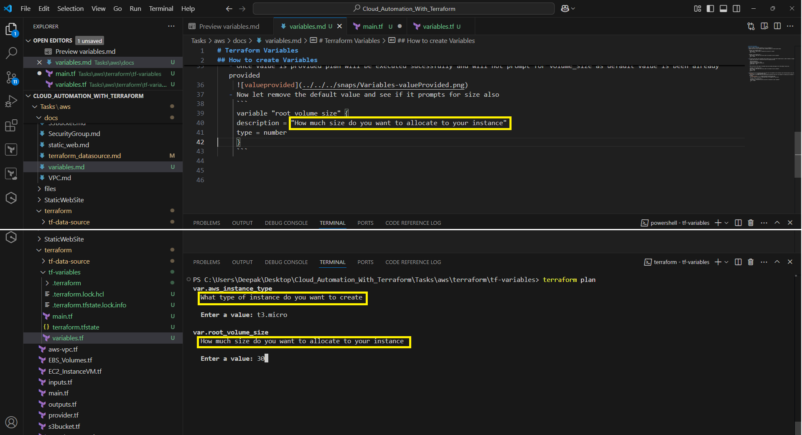
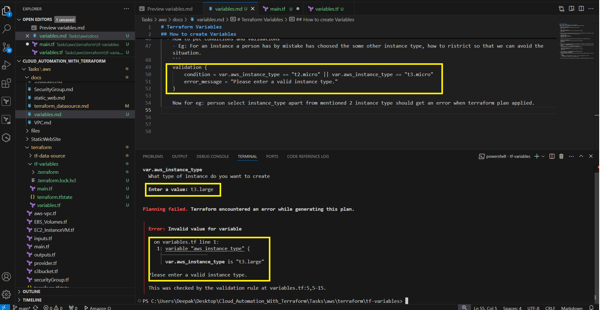

# Terraform Variables
## How to create Variables : Types, Validation, ENV, tfvars, auto.tfvars
* We can create a file with extension .tf eg. variables.tf
* Under this file we can create as many variable blocks as we want given below.
  ```
  variable "aws_instance_type" {
    description = "What type of instance do you want to create"
    type = string
    }

  variable "root_volume_size" {
    description = "How much size do you want to allocate to your instance"
    type = number
    }
  ```
* To retreive the data from variable file we have to use .var and the variable which is been created in variables.tf file
  - Assume that you want to retrive the size of volume_size then
    ```
    root_block_device {
    delete_on_termination = true
    volume_size = var.root_volume_size
    volume_type = "gp2"
    }
    ```
  - You can even set the type of variable and also provide previlage to set the default value also
    ```
    variable "root_volume_size" {
    description = "How much size do you want to allocate to your instance"
    type = number
    default = 10
    }
    ```
* So when ever you do terraform plan the value will be promoted on the terminal with the description value which you provided.
  
   - Once value is provided plan will be executed sucessfully and will not prompt for volume_size as default value is been already provided
     
   - Now let remove the default value and see if it prompts for size also
     ```
     variable "root_volume_size" {
     description = "How much size do you want to allocate to your instance"
     type = number
     }
     ```
     
* Let's provide default value and proceed.
  - How to put conditions and validations 
    - Eg: For an instance a person has by mistake has choosed the some other instance type, how to ristrict so that we can avoid the situation.
    ```
    validation {
        condition = var.aws_instance_type == "t2.micro" || var.aws_instance_type == "t3.micro"
        error_message = "Please enter a valid instance type."
    }
    ```
    Now for eg: person select instance_type apart from mentioned 2 instance type should get an error when terraform plan applied.
    
* How to combine two or more variables effectively.
  Ex: We have 2 different Variables below to same `root_block_device`
  ```
  variable "root_variable_config" {
    type = object({
      v_size = number
      v_type = string
    })
    default = {
      v_size = 20
      v_type = "gp2"
        }
    }
    ```
    How to use the variables created.
    ```
    root_block_device {
        delete_on_termination = true
        volume_size = var.root_variable_config.v_size
        volume_type = var.root_variable_config.v_type
    }
    ```
* Since this is instance name is hardcoded, assume that using same config anyone want to create EC2 instance 
  all instance name will remain same as it's hardcoded to make it dynamic we use map and merge. let's see the usecase below.
  ```
  tags = {
    Name = "my-instance"
  }
  ```
  use case
  - create one more variable like below
  ```
    variable "addtional_tags" {
        type = map(string)      #expecting key=value format
        default = {}
    }
  ```
  to use it :
  ```
    tags = merge(var.addtional_tags, {
        Name = "SampleServer"
    })
  ```

## Environment Variables
* How to set environment variable
  syntax : export TF_VAR_Key=value
  ```powershell
  export TF_VAR_aws_instance_type=t2.micro
  ```
## terraform.tfvars Variables
  Create a tf with exactly same file name (i.e terraform.tfvars) [A file name should be in terraforms standards]
  1. Now goto your variables.tf file and copy all the variables that you have created and paste it in the terraform.tfvars file
     Basically this is the root lavel of var file whhere you can ease assigning the value from the very top level.
    ```
    aws_instance_type = "t2.micro"
    root_variable_config = {
        v_size = 10
        v_type = "gp3"
    }
    addtional_tags = {
    DEPT = "QA"
    PROJECT = "MyProject-QA"
    }
    ```
## prod.auto.tfvars Variables
   Use Case:
   Now lets assume that I have to change 
   ```
   root_variable_config = {
        v_size = 40
        v_type = "gp3"
    }
   ```
   and we want these configuration in prod environment.
   So basically what ever details we mention in name.auto.tfvars file that will be over ridden by terraform.tfvars file

## -var & -var-file Variables
    Use Case:
    Now lets assume that I have to change 
    ```
    root_variable_config = {
        v_size = 40
        v_type = "gp3"
    }
    ```
    Assume that you still want to over ride the value which is provided in the auto.tfvars file will be over ride the values

### So basically the conclusion he is:
    We can set the environment variable --> export TF_VAR_key=value on the terminal                     (low preference)
               |
               |
              \./
    Terraform.tfvars values will over ride set the variable from terminal                               (higher preference)
               |
               |
              \./
    FileName.auto.tfvars file will again over ride the value set by the Terraform.tfvars file           (highest reference)
               |
               |
              \./
    Finally -var or var-file variables will over ride FileName.auto.tfvars variables initialized        (superior preference)

```bash
    terraform plan -var='root_variable_config{v_size=50, v_type="gp2"}'
```
## Local Variables
```
    locals {
        owner = "ABC"
        name = "XYZ"
    }
 ```
usecase:
```
    tags = merge(var.addtional_tags, {
    Name = locals.name
    })
```


